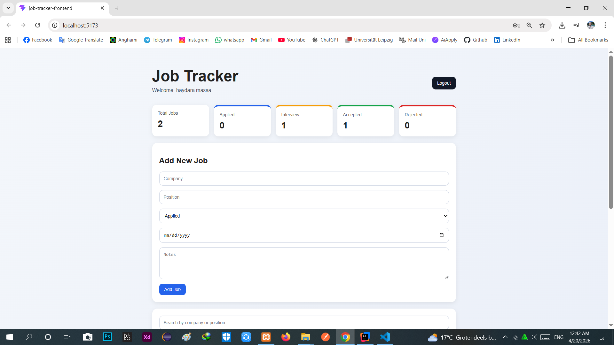
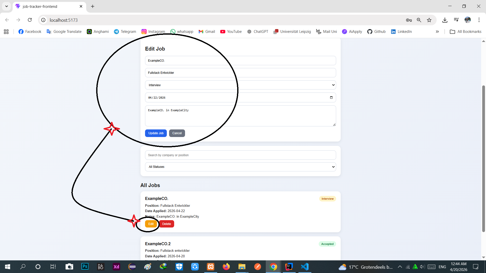
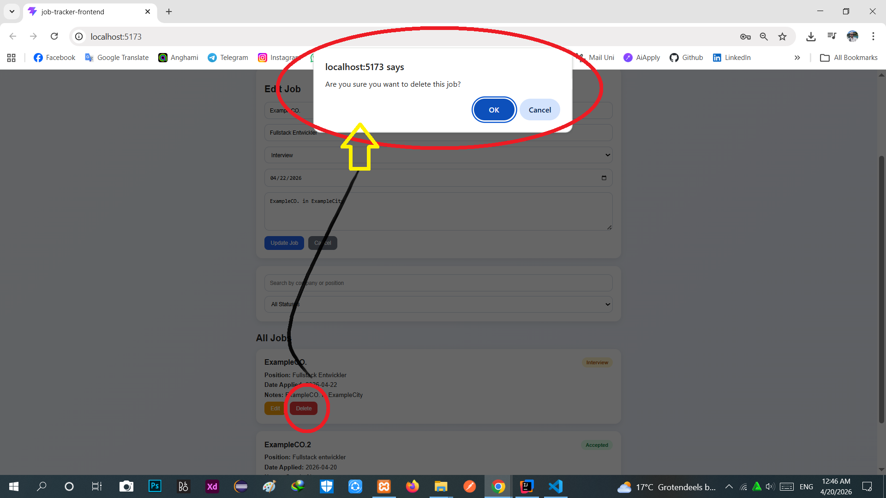

# Job Tracker Project

> **Status:** This project is still under development.

A full-stack web application for tracking job applications in a clean and organized way.

## Features

- User registration
- User login
- Password strength validation
- Logout confirmation
- Add new job applications
- View all job applications
- Edit job applications
- Delete job applications
- Search by company or position
- Filter by status
- Dashboard statistics
- Jobs linked to the logged-in user
- Responsive and clean UI

## Technologies Used

### Frontend
- React
- JavaScript
- CSS
- Vite

### Backend
- Java
- Spring Boot
- Spring Data JPA
- Spring Security Crypto

### Database
- MySQL

### Build Tools
- Gradle
- npm

## Project Structure

```text
job-tracker-project
├── job-tracker-backend
└── job-tracker-frontend
```


The project includes:

- Register
- Login
- Password validation
- Password strength feedback
- Local user session with localStorage

## Job Management

Each logged-in user can:

- Create jobs
- View only their own jobs
- Edit their own jobs
- Delete their own jobs

## Job Fields

Each job application contains:

- Company
- Position
- Status
- Date Applied
- Notes

## Status Options

- Applied
- Interview
- Accepted
- Rejected

## UI Features

- Modern login/register page
- Dashboard cards
- Search and filter section
- Styled job cards
- Color-coded status badges
- Friendly validation messages

## Future Improvements

- Docker support
- Better backend validation
- JWT authentication
- User-specific authorization improvements
- Pagination
- Sorting options
- Improved dashboard charts

## Author

Haydara Massa


## Screenshots

### Authentication


### Dashboard



### Job Actions


