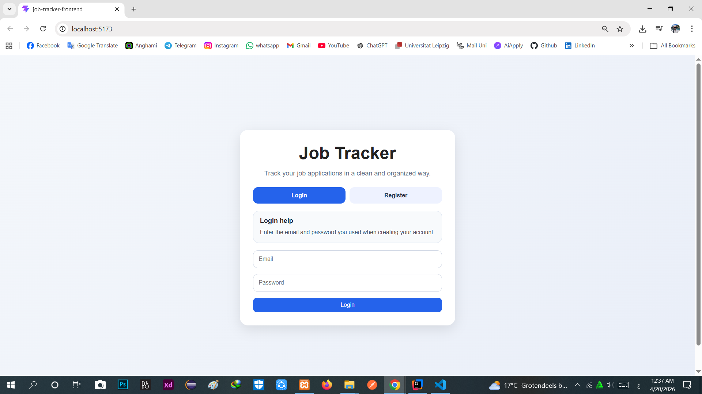
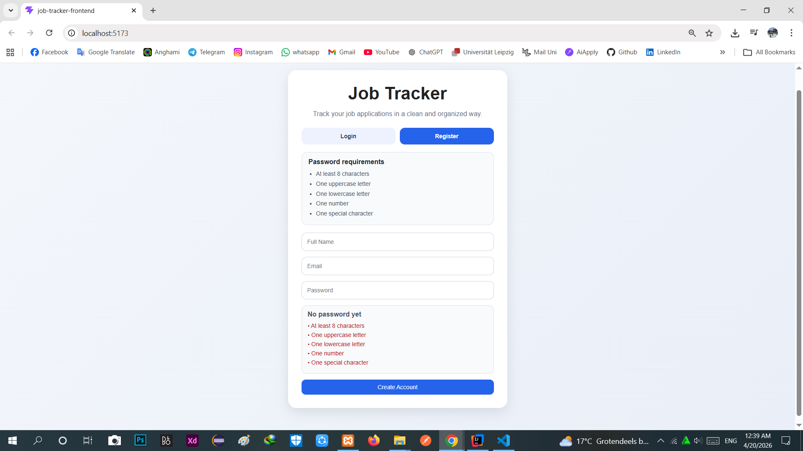
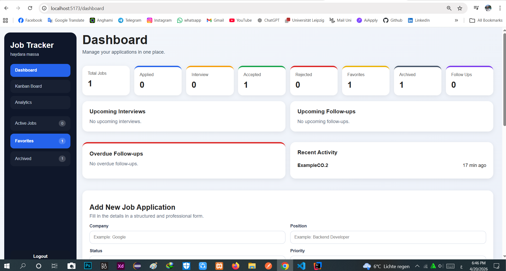
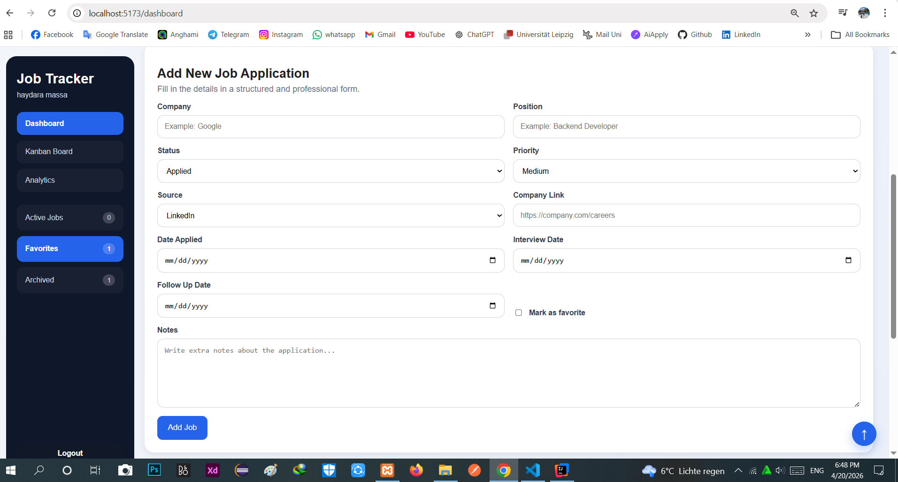
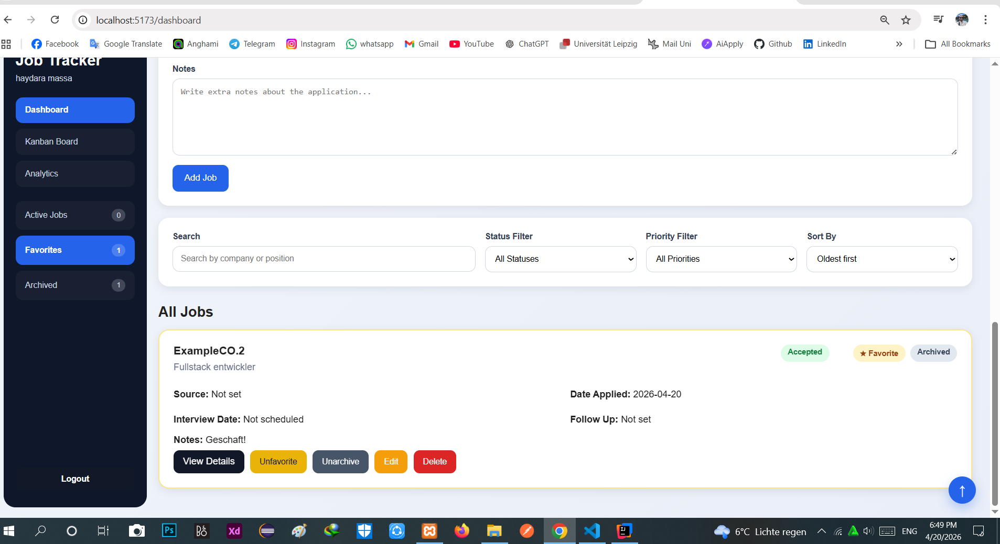
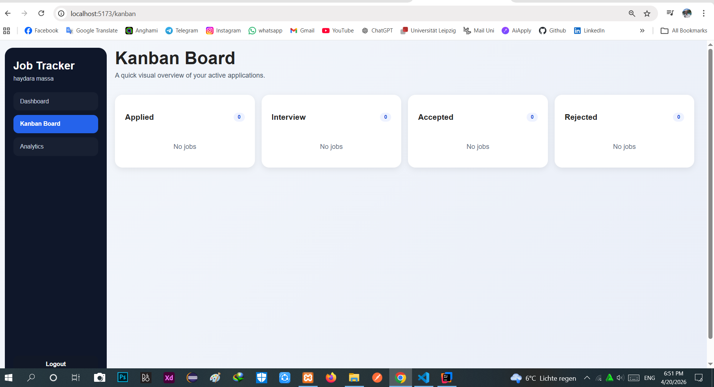
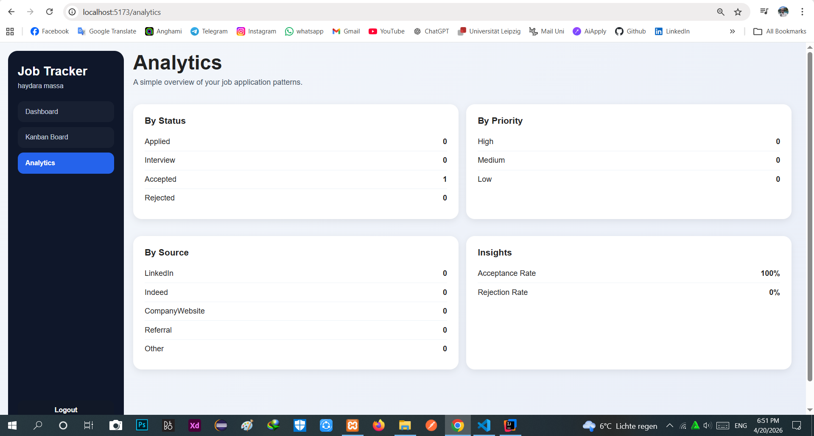

# Job Tracker Project


> **Status:** This project is still under development, but the core features are implemented and working.

A full-stack web application for tracking job applications in a clean, organized, and professional way.


## Features

- User registration
- User login
- Password strength validation
- Logout confirmation
- Add new job applications
- View all job applications
- Edit job applications
- Delete job applications
- Search by company or position
- Filter by status
- Dashboard statistics
- Jobs linked to the logged-in user
- Responsive and clean UI

## Technologies Used

### Frontend
- React
- JavaScript
- CSS
- Vite
- React Router DOM

  
### Backend
- Java
- Spring Boot
- Spring Data JPA
- Spring Security Crypto

### Database
- MySQL

### Build Tools
- Gradle
- npm

## Project Structure

```text
job-tracker-project
├── job-tracker-backend
└── job-tracker-frontend
```
## Pages

- Authentication Page
- Dashboard Page
- Job Details Page
- Kanban Board Page
- Analytics Page

## Authentication

The project includes:

- Register
- Login
- Password validation
- Password strength feedback
- Local user session with localStorage

## Job Management

Each logged-in user can:

- Create jobs
- View only their own jobs
- Edit their own jobs
- Delete their own jobs
- Mark jobs as favorite
- Archive and unarchive jobs

## Job Fields

Each job application contains:

- Company
- Position
- Status
- Priority
- Source
- Company Link
- Date Applied
- Interview Date
- Follow Up Date
- Notes

## Status Options

- Applied
- Interview
- Accepted
- Rejected

## UI Features

- Sidebar navigation
- Dashboard summary cards
- Search and filter section
- Sort options
- Styled job cards
- Color-coded status badges
- Priority badges
- Scroll to top button
- Friendly validation messages
- Empty states
- Notes preview

## Dashboard Widgets

- Upcoming Interviews
- Upcoming Follow-ups
- Overdue Follow-ups
- Recent Activity

## Future Improvements

- JWT authentication
- Better backend validation
- Email reminders
- Drag and drop Kanban
- Deployment
- Docker support after Windows update

## Author

Haydara Massa
## Screenshots

### Login


### Registration


### Dashboard Overview


### Dashboard - Job Management


### Dashboard - Jobs List


### Kanban Board


### Analytics

